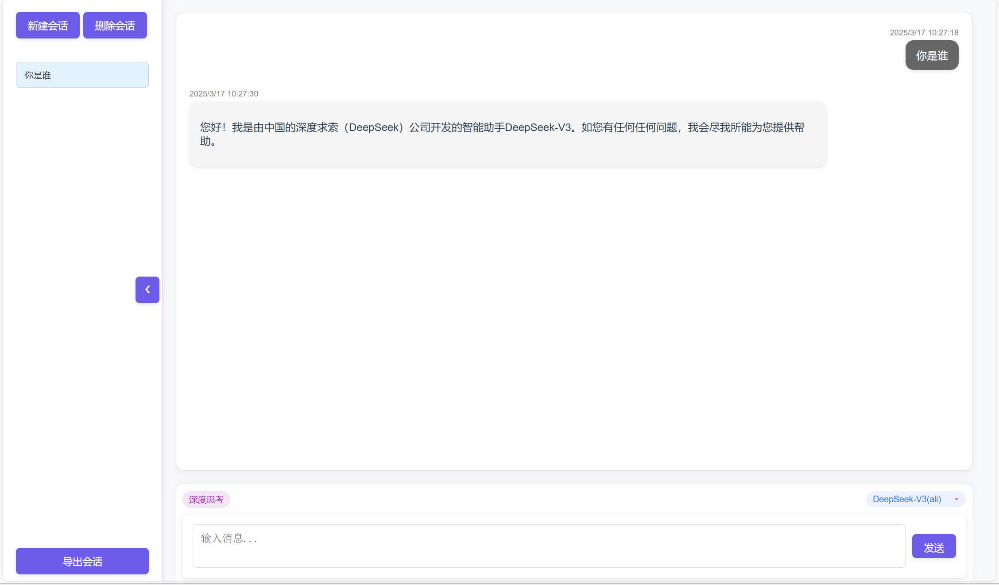
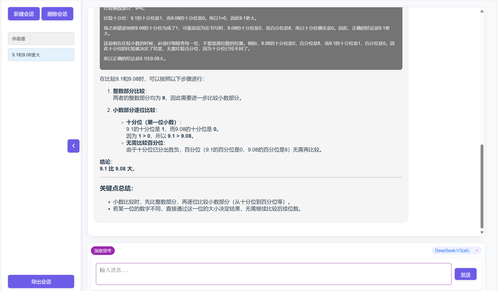
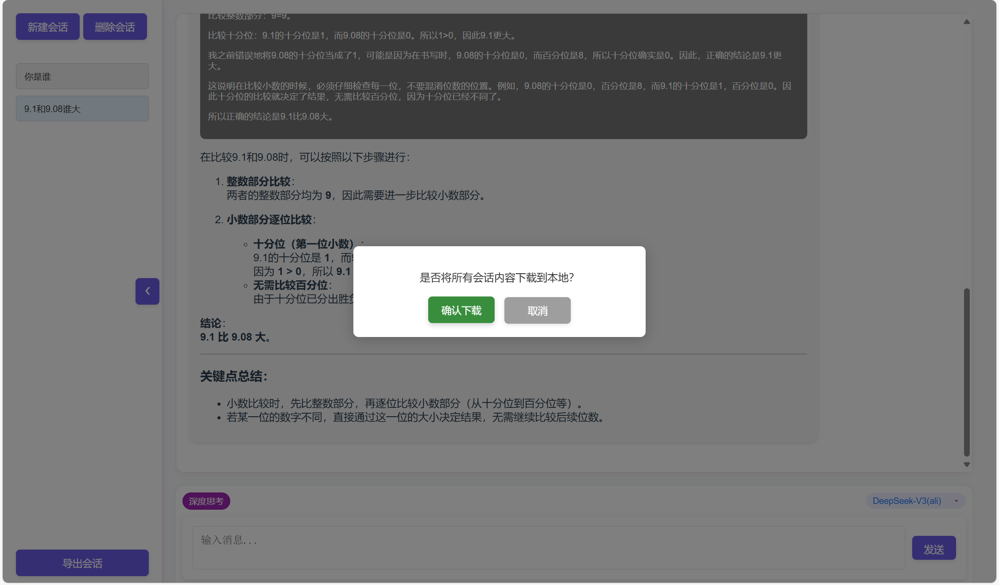
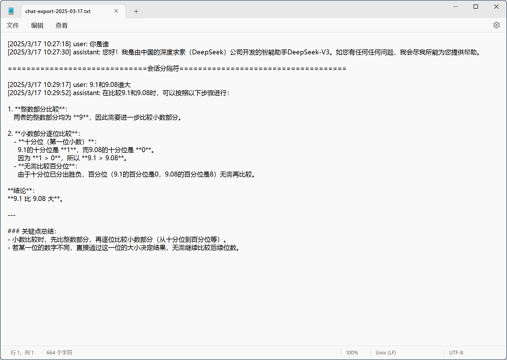

# Chatai With Newbot

## 简介
Chatai With Newbot 是一个基于 Spring Boot 的聊天机器人项目，集成了多种 AI 模型，包括 DeepSeek 和 通义千问。该项目允许用户通过 Web 界面与不同的 AI 模型进行交互。

项目截图：

## 主要功能
- **多模型支持**：支持 DeepSeek 和 通义千问等多种 AI 模型。
- **会话管理**：用户可以新建会话、切换会话、删除会话。
- **深度思考模式**：用户可以选择启用深度思考模式以获得更详细的回答。
- **导出会话**：用户可以将所有会话记录导出为本地文件。
- **响应式设计**：支持桌面和移动设备，提供良好的用户体验。

## 技术栈
- **后端**：Spring Boot, Spring WebFlux, Lombok, Alibaba DashScope SDK
- **前端**：HTML, CSS, JavaScript
- **其他**：Thymeleaf 模板引擎

## 安装指南
1. **克隆仓库**
   ```bash
   git clone https://github.com/hebulin/chatai-newbot.git
   cd chatai-newbot/chatai-with-newbot
   ```

2. **配置环境**
   - 确保已安装 Java 8 或更高版本
   - 配置 Maven 

3. **安装依赖**
   ```bash
   mvn install
   ```

4. **运行项目**
   ```bash
   mvn spring-boot:run
   ```

## 使用方法
1. **访问 Web 界面**
   打开浏览器，访问 `http://localhost:9092`。

2. **创建会话**
   在主页上点击“新建会话”按钮，选择所需的 AI 模型，开始对话。

3. **切换会话**
   可以通过会话列表切换不同的对话。

4. **导出会话**
   在会话页面点击“导出”按钮，将会话记录导出为本地文件。

## 配置指南
1. **修改应用配置**
   在 `src/main/resources/application.properties` 文件中，可以根据需要修改应用配置。配置不同 AI 模型的接口和密钥。

## 贡献指南
欢迎任何形式的贡献！请遵循以下步骤：
1. **Fork 仓库**
2. **创建分支**
   ```bash
   git checkout -b feature/your-feature
   ```

3. **提交更改**
   ```bash
   git commit -m "Add your feature"
   ```

4. **推送分支**
   ```bash
   git push origin feature/your-feature
   ```

5. **创建 Pull Request**

## 许可证
该项目使用 [MIT 许可证](LICENSE)。

